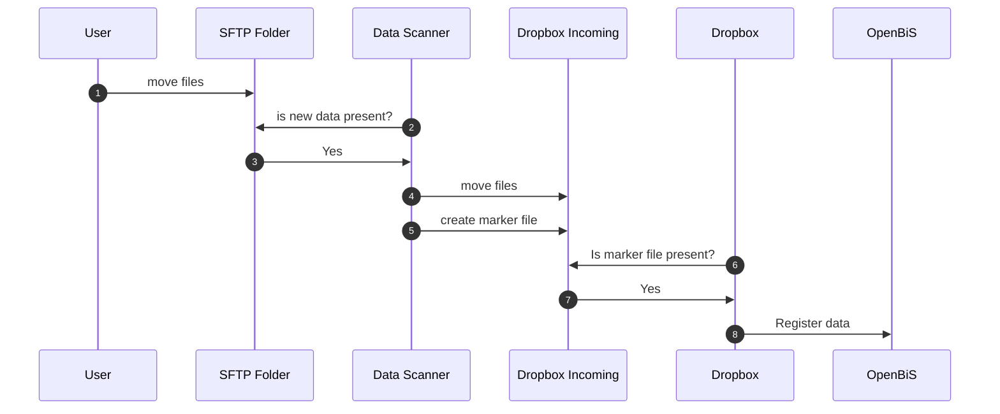
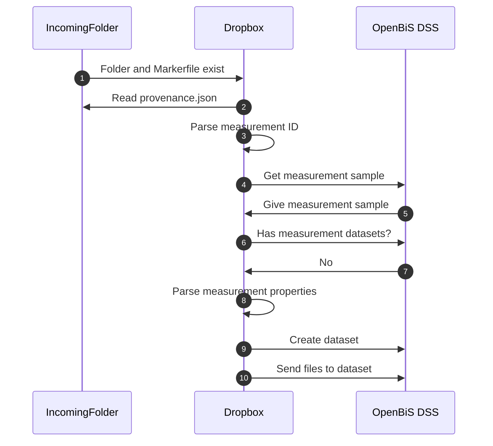

# OpenBiS Dropboxes

!!! abstract
After the [Data Scanner](https://github.com/qbicsoftware/data-processing), data registration in openbis can be automated by dropboxes.
We use Java Dropboxes to move files into OpenBis (see
the [Documentation on Java Dropboxes](https://openbis.readthedocs.io/en/20.10.x/software-developer-documentation/server-side-extensions/dss-dropboxes.html#java-dropboxes))

## Context




### Dropbox Process

The dropbox processes the data before moving it into OpenBiS. A successful processing is shown
below.

The process is triggered when a marker filed called `MARKER_is_finished_<dirname>` with `<dirname>` being the folder to be registered, is created.



### Dropbox Configuration

The dropbox configuration can be found
at `...` on the OpenBiS instance. Each folder within this directory creates a dropbox.

Within each folder exists a directory `lib` and a file `plugin.properties`. The `lib` folder is
where you place your dropbox `jar` file. The `plugin.properties` is where you configure your
dropbox.

```properties title="plugin.properties" linenums="1"
incoming-dir=...
incoming-data-completeness-condition=marker-file
top-level-data-set-handler=ch.systemsx.cisd.etlserver.registrator.api.v2.JavaTopLevelDataSetHandlerV2
program-class=life.qbic.registration.openbis.OpenBisDropboxETL
storage-processor=ch.systemsx.cisd.etlserver.DefaultStorageProcessor
```
!!! info
Ususally you only need to adapt the `incoming-dir` and `program-class` when setting up a new dropbox.
For more configuration options please see the [OpenBiS documentation](https://openbis.readthedocs.io/en/20.10.x/software-developer-documentation/server-side-extensions/dss-dropboxes.html#configuration).
